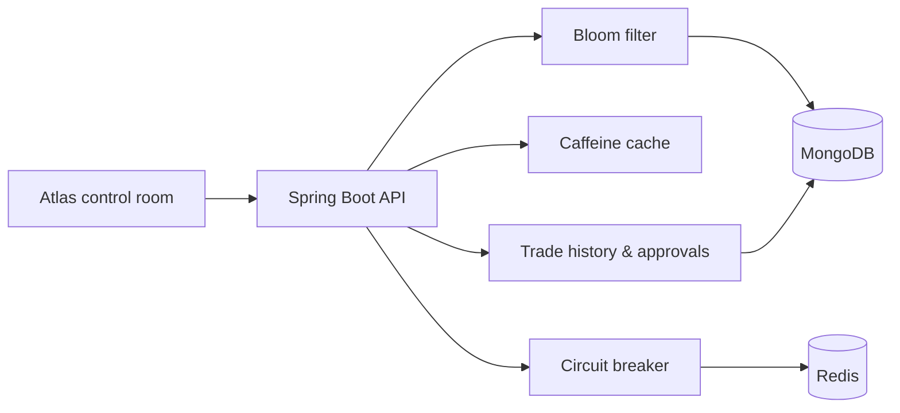

<div align="center">

# ◈ Atlas Trade Control Room

**A production-minded pre-trade risk and approval workflow, built as a compact full-stack reference architecture.**

[](https://github.com/Alaneel/atlas-trade-control-room/actions/workflows/ci.yml)
[](https://openjdk.org/)
[](https://spring.io/projects/spring-boot)
[](LICENSE)

[Explore the architecture](ARCHITECTURE.md) · [Read the API](#api-surface) · [Contribute](CONTRIBUTING.md)

</div>

---

Atlas answers one deceptively hard question before a trade reaches execution:

> Is this instrument permitted, and does this counterparty still have enough capacity?

It combines fast instrument screening, authoritative data checks, atomic limit consumption, exception routing, and an operator-facing control room. The repository is intentionally small enough to understand in an afternoon while still demonstrating the patterns used in risk-sensitive systems.

## Why this project is interesting

- **Layered validation** — a Bloom filter quickly rejects obvious misses before MongoDB performs the authoritative lookup.
- **Resilient limits** — Caffeine handles local hot reads, while Redis integration is isolated behind a circuit breaker.
- **Explainable decisions** — trades produce explicit approval or rejection outcomes and are written to trade history.
- **Human-in-the-loop workflow** — unknown instruments can be routed into an approval request instead of disappearing into an error log.
- **Zero-infrastructure demo** — the Streamlit control room ships with realistic sample data, so the product can be explored immediately.
- **Operational baseline** — health endpoints, Prometheus metrics, containers, coverage reporting, and security scanning are included.

## See it in 60 seconds

The fastest route is the standalone product demo; it does not require Java, MongoDB, or Redis.

```bash
git clone https://github.com/Alaneel/atlas-trade-control-room.git
cd atlas-trade-control-room
python3 -m venv .venv
source .venv/bin/activate
pip install -r python_src/requirements.txt
streamlit run python_src/trading_dashboard.py
```

Open [localhost:8501](http://localhost:8501). Demo data is enabled by default. Use the sidebar toggle when you are ready to connect the real API.

## Run the complete stack

Docker Compose starts the dashboard, API, MongoDB, and Redis together:

```bash
git clone https://github.com/Alaneel/atlas-trade-control-room.git
cd atlas-trade-control-room
docker compose up --build
```

| Surface | Address | Purpose |
|---|---|---|
| Control room | [localhost:8501](http://localhost:8501) | Operator workflow and demo |
| OpenAPI UI | [localhost:8080/swagger-ui.html](http://localhost:8080/swagger-ui.html) | Interactive API explorer |
| Health | [localhost:8080/actuator/health](http://localhost:8080/actuator/health) | Dependency and service status |
| Metrics | [localhost:8080/actuator/prometheus](http://localhost:8080/actuator/prometheus) | Prometheus scrape endpoint |

Turn off **Demo data** in the control room sidebar to use the running backend.

## Architecture



The backend follows a conventional controller → service → repository boundary. Instrument verification uses the Bloom filter as a fast negative check, but MongoDB remains the source of truth. See [ARCHITECTURE.md](ARCHITECTURE.md) for the detailed flow and design trade-offs.

## A trade's decision path

1. Verify that required instrument attributes match a permitted product.
2. Look up the counterparty limit for the requested product group.
3. Compare available capacity with requested notional.
4. Approve and record the trade, or return a clear domain error.
5. Route an unknown instrument to approval when an operator requests it.

## API surface

| Method | Endpoint | Description |
|---|---|---|
| `POST` | `/api/trader/verify-instrument` | Validate an instrument definition |
| `POST` | `/api/trader/trade` | Evaluate and record a trade |
| `GET` | `/api/trader/limit/{counterparty}/{group}` | Read available capacity |
| `GET` | `/api/trader/trades` | Return trade decision history |
| `POST` | `/api/trader/approval-request` | Route an exception for review |

Once the backend is running, Swagger UI contains the request schemas and lets you call each endpoint interactively.

## Technology choices

| Layer | Technology | Role |
|---|---|---|
| UI | Streamlit, Pandas | Operational control room and instant demo |
| API | Java, Spring Boot | Validation, decisions, exception mapping |
| Primary store | MongoDB | Instruments, limits, trades, approvals |
| Fast path | Redis, Caffeine, Guava | Distributed/local caching and Bloom screening |
| Reliability | Resilience4j, Actuator | Circuit breaking, health, and metrics |
| Delivery | Docker Compose, GitHub Actions | Reproducible local stack and CI |

## Development

Requirements for backend development are Java 11+, Maven 3.6+, MongoDB 7, and Redis 7.

```bash
# Build and test the backend
mvn clean test

# Run the backend against local dependencies
mvn spring-boot:run

# Run the UI against that API
DEMO_MODE=false BACKEND_API_URL=http://localhost:8080 \
  streamlit run python_src/trading_dashboard.py
```

Useful shortcuts are available through `make help`. Configuration can be overridden with `MONGODB_URI`, `REDIS_HOST`, `REDIS_PORT`, `SERVER_PORT`, and `BACKEND_API_URL`; see [.env.example](.env.example).

## Repository map

```text
src/main/java/com/gic/
├── controller/     HTTP boundary
├── service/        decision and workflow logic
├── repository/     MongoDB persistence
├── model/          domain records
├── exception/      typed failures and API responses
├── config/         cache, security, OpenAPI, seed data
└── health/         operational checks

python_src/         Atlas control room
.github/workflows/  CI and dependency automation
```

## Roadmap

- [ ] Optimistic locking for concurrent limit consumption
- [ ] Immutable audit events with actor and rationale
- [ ] Role-based approval actions
- [ ] Testcontainers-based integration suite
- [ ] OpenTelemetry traces across decision stages

## Contributing and security

Small, focused pull requests are welcome. Start with [CONTRIBUTING.md](CONTRIBUTING.md), and avoid including real counterparty or trading data in issues and fixtures. This repository is a portfolio/reference implementation, not a production trading platform.

Released under the [MIT License](LICENSE).
